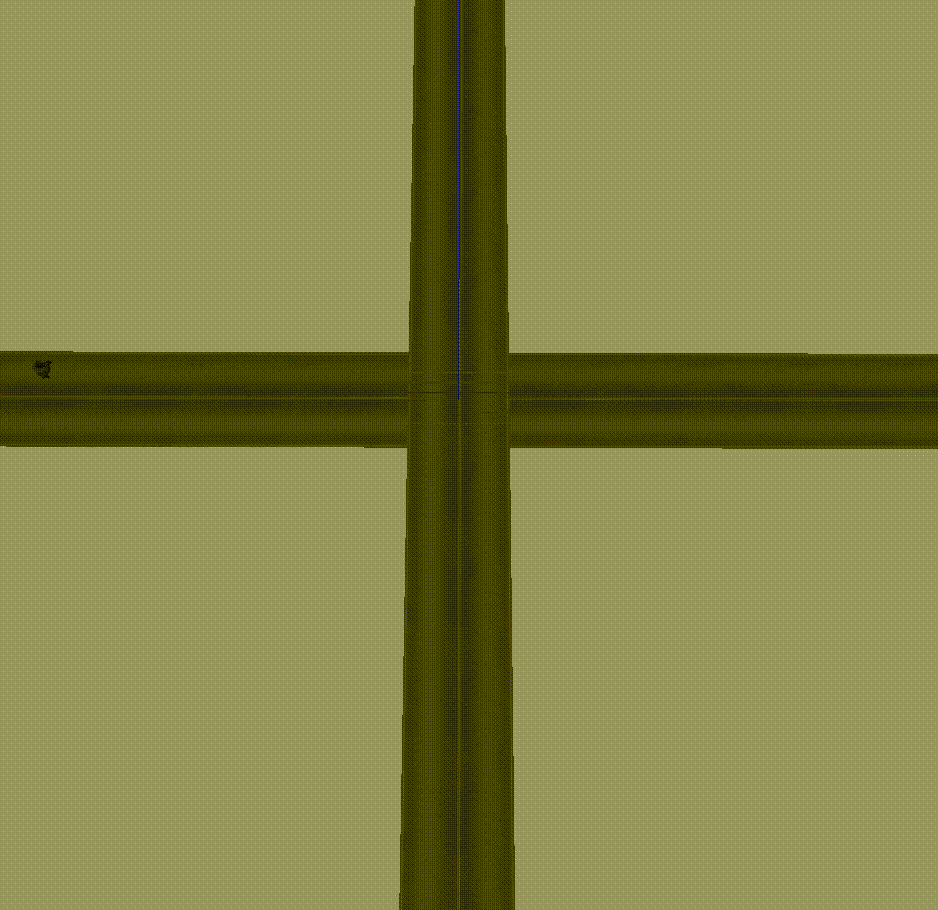
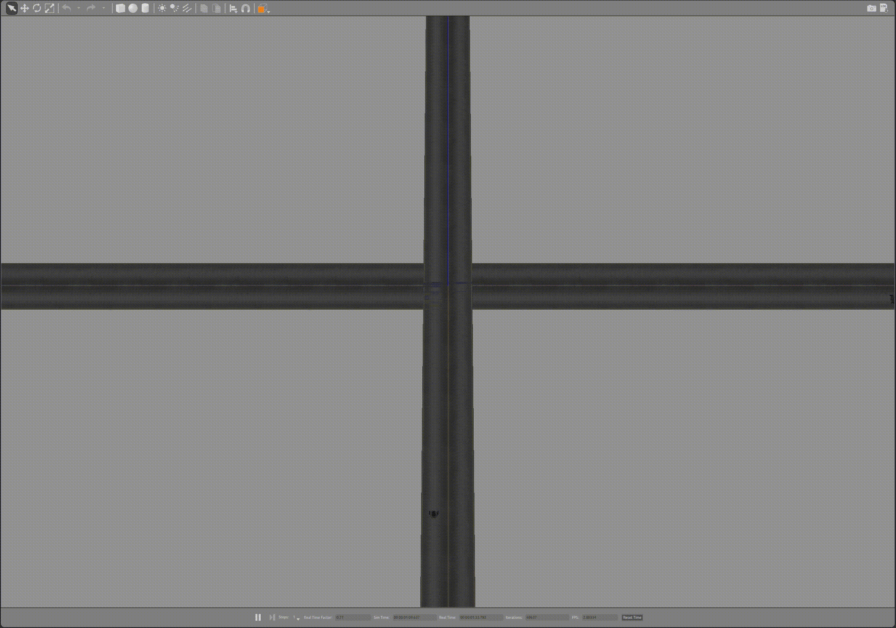

# Multi-robot-traffic-simulation

Demonstration of vehicle management utilising intersection manager. Intuitively, each robot could run the intersection manager on it's on board computer negating the reliance on a central intersection manager. Please refer to the following paper for a description of the policy managing the intersection[to do].

Complexity of intersection allowing only for movement that is straight or left is very efficient processing traffic very efficiently. 

Incorporating right turn into intersection management policy decreases the efficiency of throughput. To minimise this effect, during the critical section when an agent is turning right. Other agents queuing the intersection can tailgate the turning robot provided it is safe. That is, an agent heading west direction can tailgate behind an agent turning right from north direction to east direction.

